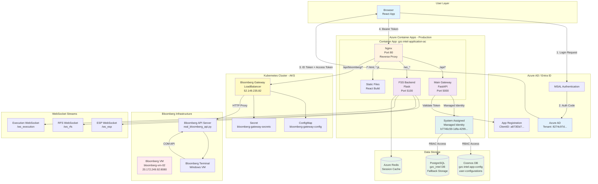
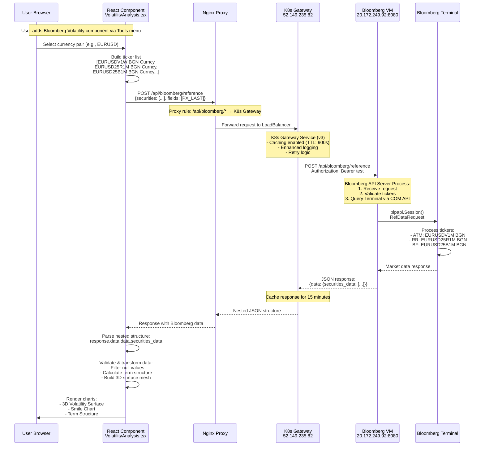

# GZC Intel Application - Complete Architecture Diagram

## System Architecture Overview



## Bloomberg Volatility Component - Detailed Data Flow



## Authentication & Authorization Details

```mermaid
graph LR
    subgraph "Frontend Authentication"
        MSAL[MSAL.js<br/>localStorage]
        LoginFlow[Login Flow:<br/>1. Popup/Redirect<br/>2. Get ID Token<br/>3. Get Access Token]
        Scopes[Scopes:<br/>- User.Read<br/>- api://a873f2d7.../.default]
    end

    subgraph "Backend Authorization"
        JWT[JWT Validation<br/>validate_token()]
        Claims[Token Claims:<br/>- sub: user ID<br/>- email: user email<br/>- preferred_username]
        RBAC[RBAC Check:<br/>- Cosmos DB access<br/>- PostgreSQL access]
    end

    subgraph "Managed Identity"
        SystemID[System Assigned<br/>principalId: b7746c59...]
        DefaultCred[DefaultAzureCredential<br/>Auto-auth in Azure]
        Resources[Access to:<br/>- Cosmos DB<br/>- Key Vault<br/>- PostgreSQL]
    end

    MSAL --> LoginFlow
    LoginFlow --> Scopes
    Scopes -->|Bearer Token| JWT
    JWT --> Claims
    Claims --> RBAC
    
    SystemID --> DefaultCred
    DefaultCred --> Resources
```

## Component Memory Persistence

```mermaid
graph TD
    subgraph "User Action"
        AddComp[User adds Bloomberg<br/>Volatility Component]
        TabState[Tab State Updated]
    end

    subgraph "Frontend State Management"
        TabManager[TabLayoutManager.tsx]
        CosmosService[cosmosConfigService.ts]
        LocalStorage[localStorage Fallback]
    end

    subgraph "Backend Persistence"
        MainGateway[Main Gateway<br/>/api/cosmos/config]
        AuthCheck{Token Valid?}
        CosmosCtrl[cosmos_config_controller.py]
    end

    subgraph "Data Storage"
        CosmosDB[(Cosmos DB<br/>Document Structure:<br/>{<br/>  id: user-email,<br/>  tabs: [...],<br/>  layouts: [...],<br/>  preferences: {...}<br/>})]
        PostgreSQL[(PostgreSQL<br/>Fallback Tables:<br/>- user_preferences<br/>- user_sessions)]
    end

    AddComp --> TabState
    TabState --> TabManager
    TabManager --> CosmosService
    
    CosmosService -->|POST /api/cosmos/config| MainGateway
    MainGateway --> AuthCheck
    AuthCheck -->|Yes| CosmosCtrl
    AuthCheck -->|No| LocalStorage
    
    CosmosCtrl -->|Managed Identity| CosmosDB
    CosmosCtrl -->|Fallback| PostgreSQL
    
    CosmosDB -->|Cross-browser sync| TabManager
```

## Network Security & Routing

```yaml
Production URL: https://gzc-intel-application-ac.delightfulground-653e61be.eastus.azurecontainerapps.io

Nginx Routing Rules:
  /                    → Static React files
  /api/*              → Main Gateway (port 5000)
  /api/bloomberg/*    → K8s Gateway (52.149.235.82)
  /ws_esp             → FSS Backend WebSocket
  /ws_rfs             → FSS Backend WebSocket  
  /ws_execution       → FSS Backend WebSocket

Security Headers:
  - X-Content-Type-Options: nosniff
  - X-Frame-Options: DENY
  - Strict-Transport-Security: max-age=31536000
  - Content-Security-Policy: restrictive

CORS Configuration:
  - Allowed Origins: Production URL + localhost:3500/3501
  - Credentials: true
  - Methods: GET, POST, PUT, DELETE, OPTIONS
```

## Bloomberg Data Processing Pipeline

### 1. Ticker Construction (Frontend)
```javascript
// VolatilityAnalysis.tsx builds tickers:
const tenors = ['1W', '2W', '1M', '2M', '3M', '6M', '9M', '1Y']
const strikes = ['25R', 'ATM', '25B']  // Risk Reversal, At-The-Money, Butterfly

// Generated tickers for EURUSD:
EURUSDV1W BGN Curncy    // ATM 1 week
EURUSD25R1M BGN Curncy  // 25-delta risk reversal 1 month
EURUSD25B1M BGN Curncy  // 25-delta butterfly 1 month
```

### 2. K8s Gateway Processing
```python
# bloomberg-gateway service in K8s:
- Receives request at LoadBalancer IP
- Checks Redis cache (TTL: 900 seconds)
- If cache miss, forwards to Bloomberg VM
- Applies retry logic (3 attempts)
- Returns nested JSON structure
```

### 3. Bloomberg VM API Server
```python
# real_bloomberg_api.py on Windows VM:
@app.post("/api/bloomberg/reference")
async def get_reference_data(request: ReferenceDataRequest):
    # 1. Create Bloomberg session
    session = blpapi.Session()
    
    # 2. Open service
    session.openService("//blp/refdata")
    
    # 3. Create request
    request = service.createRequest("ReferenceDataRequest")
    
    # 4. Add securities and fields
    for security in securities:
        request.append("securities", security)
    for field in fields:
        request.append("fields", field)
    
    # 5. Send request and parse response
    session.sendRequest(request)
    
    # 6. Return structured data
    return {"data": {"securities_data": [...]}}
```

### 4. Data Validation & Transformation
```javascript
// DataValidator.ts validates response:
- Checks for nested structure: response.data?.data?.securities_data
- Validates each security has success: true
- Filters out null/undefined values
- Transforms to ValidatedVolatilityData interface

// VolatilityAnalysis.tsx processes data:
- Parses tenor strings (1W → 7 days, 1M → 30 days)
- Calculates volatility smile curves
- Builds 3D surface mesh for Plotly
- Generates term structure time series
```

## Deployment Pipeline

```mermaid
graph LR
    subgraph "Development"
        Code[Code Changes]
        Git[Git Push to<br/>component-state-refactor]
    end

    subgraph "GitHub Actions"
        Trigger[Workflow Triggered]
        Build[Build Frontend<br/>npm run build:skip-ts]
        Docker[Build Docker Image<br/>linux/amd64]
        Push[Push to ACR<br/>gzcacr.azurecr.io]
    end

    subgraph "Azure Deployment"
        Update[Update Container App<br/>gzc-intel-application-ac]
        Revision[New Revision<br/>v20250814-HHMMSS]
        Live[Live in Production]
    end

    Code --> Git
    Git --> Trigger
    Trigger --> Build
    Build --> Docker
    Docker --> Push
    Push --> Update
    Update --> Revision
    Revision --> Live
```



## Key Component Details

### Bloomberg Volatility Component
- **Location**: `/Main_Frontend/src/components/bloomberg-volatility/`
- **Main Files**:
  - `VolatilityAnalysis.tsx` - Main component with data fetching
  - `ResponsiveVolatilityAnalysis.tsx` - Grid-responsive wrapper
  - `PlotlyVolatilitySurface.tsx` - 3D surface visualization
  - `DataValidator.ts` - Response validation logic

### Supported Currency Pairs
- EURUSD, GBPUSD, USDJPY, AUDUSD, USDCHF, USDCAD, NZDUSD

### Data Update Frequency
- Manual refresh via UI button
- Cache TTL: 15 minutes (K8s Gateway)
- Real-time data from Bloomberg Terminal when available

### Error Handling
- Graceful fallback when Terminal offline
- Validation of all data points
- User-friendly error messages
- Automatic retry logic in K8s Gateway