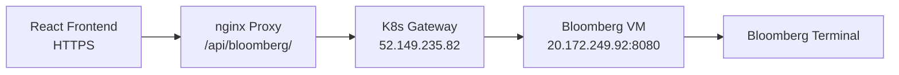

# Bloomberg Terminal Integration Guide

## Overview

The GZC Intel Application integrates with Bloomberg Terminal to provide real-time FX options volatility data through a secure, enterprise-grade architecture.

## Architecture



### Components

1. **Frontend Component**: `Main_Frontend/src/components/bloomberg-volatility/`
2. **K8s Gateway**: Deployed in `bloomberg-gateway` namespace
3. **Bloomberg VM**: Azure VM with Terminal installed
4. **Data Flow**: 100% through K8s gateway (no direct VM access)

## Bloomberg Volatility Component

### Features
- **3D Volatility Surfaces**: Interactive Plotly visualizations
- **Volatility Smile**: Cross-strike analysis for each tenor
- **Term Structure**: Volatility evolution across tenors
- **Real-time Updates**: Live Bloomberg Terminal data
- **Professional Layout**: Multi-chart dashboard view

### Supported Markets
- **Currency Pairs**: EURUSD, GBPUSD, USDJPY, AUDUSD, USDCHF, USDCAD, NZDUSD
- **Tenors**: ON, 1W, 2W, 1M, 2M, 3M, 6M, 9M, 1Y, 18M, 2Y
- **Deltas**: 5D, 10D, 15D, 25D, 35D
- **Products**: ATM, Risk Reversals, Butterflies

### Data Points
For each currency pair and tenor:
- **ATM Volatility**: At-the-money implied volatility
- **Risk Reversals**: 25D-Put minus 25D-Call volatility
- **Butterflies**: Smile curvature indicator
- **Bid/Ask Spreads**: Market liquidity metrics

## User Guide

### Adding the Component
1. Navigate to the application: https://gzc-intel-application-ac.delightfulground-653e61be.eastus.azurecontainerapps.io
2. Click **Tools** → **Add Component**
3. Select **Visualization** category
4. Choose **Bloomberg Volatility Analysis**
5. Click to add to current tab
6. Resize by dragging corners

### Using the Component
- **Currency Selection**: Dropdown to switch between FX pairs
- **3D Surface**: Rotate/zoom with mouse
- **Volatility Smile**: Shows skew across strikes
- **Term Structure**: Displays term evolution
- **Data Quality**: Color-coded indicators (green = good, yellow = partial, red = missing)

## Technical Implementation

### K8s Gateway Endpoints

```bash
# Reference Data
POST http://52.149.235.82/api/bloomberg/reference
{
  "securities": ["EURUSDV1M BGN Curncy"],
  "fields": ["PX_LAST", "PX_BID", "PX_ASK"]
}

# Volatility Surface
POST http://52.149.235.82/api/volatility-surface/EURUSD
["1W", "1M", "3M", "6M", "1Y"]
```

### Frontend Data Parsing

The component handles K8s gateway's nested response format:

```javascript
// K8s Gateway Response
{
  "data": {
    "data": {
      "securities_data": [
        {
          "security": "EURUSDV1M BGN Curncy",
          "fields": { "PX_LAST": 7.395 },
          "success": true
        }
      ]
    }
  }
}

// Frontend parses and groups by tenor
const byTenor = {}
securities.forEach(sec => {
  // Extract tenor from ticker
  // Group ATM, RR, BF values
})
```

### Ticker Format
- **ATM**: `{PAIR}V{TENOR} BGN Curncy` (e.g., EURUSDV1M)
- **Risk Reversal**: `{PAIR}{DELTA}R{TENOR} BGN Curncy` (e.g., EURUSD25R1M)
- **Butterfly**: `{PAIR}{DELTA}B{TENOR} BGN Curncy` (e.g., EURUSD25B1M)
- **ON Special Case**: No BGN suffix for overnight

## Operations

### K8s Gateway Management

```bash
# Check status
kubectl get pods -n bloomberg-gateway

# View logs
kubectl logs deployment/bloomberg-gateway -n bloomberg-gateway --tail=50

# Update deployment
kubectl set image deployment/bloomberg-gateway \
  bloomberg-gateway=gzcacr.azurecr.io/bloomberg-gateway:v3 \
  -n bloomberg-gateway

# Scale replicas
kubectl scale deployment bloomberg-gateway --replicas=3 -n bloomberg-gateway
```

### Bloomberg VM Management

```bash
# Check VM health
curl http://20.172.249.92:8080/health

# Restart Bloomberg API
az vm run-command invoke \
  -g bloomberg-terminal-rg \
  -n bloomberg-vm-02 \
  --command-id RunPowerShellScript \
  --scripts "Get-Process python* | Stop-Process -Force; cd C:\Bloomberg\APIServer; Start-Process python.exe -ArgumentList 'real_bloomberg_api.py'"
```

### Monitoring

```bash
# Gateway metrics
curl http://52.149.235.82/api/cache/stats

# Recent requests
kubectl logs deployment/bloomberg-gateway -n bloomberg-gateway \
  --since=5m | grep "POST.*reference"
```

## Troubleshooting

### Component Not Loading
1. Check browser console for errors
2. Verify K8s gateway is running: `kubectl get pods -n bloomberg-gateway`
3. Check data flow: Open Network tab, look for `/api/bloomberg/` requests
4. Clear browser cache: Ctrl+Shift+R

### No Data Displayed
1. Verify Bloomberg VM is accessible: `curl http://20.172.249.92:8080/health`
2. Check K8s gateway logs for errors
3. Ensure selected currency pair has Bloomberg data
4. Try a known working pair like EURUSD

### Mixed Content Errors
- Never use direct HTTP endpoints in production
- Always use `/api/bloomberg/` proxy path
- Check nginx configuration if proxy fails

### Performance Issues
1. Check Redis cache hit rate in K8s gateway
2. Monitor Bloomberg VM CPU/memory usage
3. Consider scaling K8s gateway replicas
4. Verify network latency between components

## Security Considerations

1. **No Direct Access**: Frontend never accesses Bloomberg VM directly
2. **HTTPS Only**: All user-facing traffic encrypted
3. **K8s Network Policies**: Only gateway pods can reach Bloomberg VM
4. **Authentication**: Bearer token required for Bloomberg API
5. **Rate Limiting**: Implemented at K8s gateway level
6. **Caching**: 15-minute TTL reduces Bloomberg API load

## Future Enhancements

- [ ] Historical volatility analysis
- [ ] Volatility surface interpolation
- [ ] Custom tenor selection
- [ ] Excel/CSV export functionality
- [ ] Real-time WebSocket updates
- [ ] Volatility arbitrage indicators
- [ ] Cross-asset volatility correlation

## Support

For issues or questions:
1. Check browser console for errors
2. Review K8s gateway logs
3. Verify Bloomberg VM health
4. Contact infrastructure team for VM access

---
Last Updated: 2025-08-14
Version: 1.0